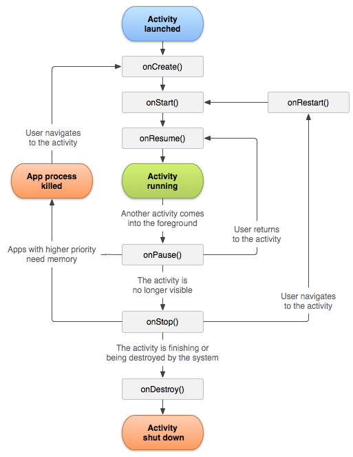

# Activity

!!! note "Note"
    Một __Activity__ là một điều duy nhất, tập trung mà người dùng có thể làm. Nghĩa là nó đơn giản chỉ là tập trung toàn bộ vào vấn đề tương tác với người dùng trên một giao diện thiết kế - cái đó sẽ được gọi là __Activity__.

## Activity Lifecycle

Các __Activity__ trong hệ thống được quản lý hoạt động như các ngăn xếp _(activityt stack)_. Khi một __Activity__ mới được bắt đầu, nó thường được đặt trên đỉnh của ngăn xếp hiện tại và trở thành hoạt động chạy _(running activity)_ - hoạt động trước đó luôn ở dưới nó trong ngăn xếp và sẽ không đi đến trên cùng _(foreground)_ một lần nữa cho đến khi hoạt động mới thoát ra. Có thể có một hoặc nhiều ngăn xếp hoạt động hiển thị trên màn hình.

Một __activity__ về cơ bản có bốn trạng thái:

- Nếu một __activity__ ở phía trước của màn hình (ở vị trí cao nhất của ngăn xếp trên cùng), nó sẽ _active_ hoặc _running_. Đây thường là hoạt động mà người dùng hiện đang tương tác.
- Nếu một __activity__ bị mất _focus_ nhưng vẫn được trình bày cho người dùng, nó có thể nhìn thấy được. Có thể nếu một __activity__ không có kích thước hoặc trong suốt mới tập trung vào __activity__ đầu của bạn, một __activity__ khác có vị trí cao hơn ở chế độ đa cửa sổ hoặc bản thân __activity__ không thể tập trung ở chế độ cửa sổ hiện tại. __Activity__ như vậy hoàn toàn sống <mark>(nó duy trì tất cả thông tin trạng thái và thành viên và vẫn được gắn vào trình quản lý cửa sổ)</mark>.
- <mark>Nếu một __activity__ bị che khuất hoàn toàn bởi một __activity__ khác, nó sẽ bị dừng hoặc ẩn. Nó vẫn giữ lại tất cả thông tin trạng thái và thành viên, tuy nhiên, người dùng không còn hiển thị vì vậy cửa sổ của nó bị ẩn và nó thường sẽ bị hệ thống xóa __kill__ khi cần có bộ nhớ ở nơi khác.</mark>
- Hệ thống có thể loại bỏ hoạt động từ bộ nhớ bằng cách yêu cầu nó hoàn thành, hoặc đơn giản là __kill__ quá trình của nó, khiến nó bị phá hủy. Khi nó được hiển thị lại cho người dùng, nó phải được khởi động lại và khôi phục hoàn toàn về trạng thái trước đó.

Biểu đồ sau đây cho thấy các đường dẫn trạng thái quan trọng của một __activity__. Các hình chữ nhật hình vuông đại diện cho các phương thức gọi lại mà bạn có thể thực hiện để thực hiện các __activity__ khi __activity__ di chuyển giữa các trạng thái. Các hình bầu dục màu là các trạng thái chính mà __activity__ có thể được đưa vào.

<figure markdown="span">
    
    <figcaption>Image caption</figcaption>
</figure>

Có ba __key loops__ chính mà bạn có thể quan tâm đến việc theo dõi trong __activity__ của mình:

- <mark>__entire lifetime__</mark> của một hoạt động xảy ra giữa cuộc gọi đầu tiên đến `onCreate(Bundle)` cho đến một cuộc gọi cuối cùng đến `onDestroy()`. Một __activity__ sẽ thực hiện tất cả các thiết lập trạng thái toàn cầu _(global)_ trong `onCreate()` và giải phóng tất cả các tài nguyên còn lại trong `onDestroy()`. Ví dụ: nếu nó có một luồng chạy trong nền để tải xuống dữ liệu từ mạng, nó có thể tạo luồng đó trong `onCreate()` và sau đó dừng luồng trong `onDestroy()`.
- <mark>__visible lifetime__</mark> của một hoạt động xảy ra giữa một cuộc gọi đến `onStart()` cho đến khi một cuộc gọi tương ứng đến `onStop()`. Trong thời gian này, người dùng có thể thấy hoạt động trên màn hình, mặc dù nó có thể không ở phía trước và tương tác với người dùng. Giữa hai phương pháp này, bạn có thể duy trì các tài nguyên cần thiết để hiển thị hoạt động cho người dùng.
    - Ví dụ: bạn có thể đăng ký một `BroadcastReceiver` trong __start()__ để theo dõi các thay đổi ảnh hưởng đến giao diện người dùng của bạn và bỏ đăng ký __onstop()__ khi người dùng không còn nhìn thấy những gì bạn đang hiển thị. Các phương thức `onStart()` và `onStop()` có thể được gọi là nhiều lần, vì hoạt động trở nên rõ ràng và ẩn với người dùng.
- <mark>__foreground lifetime__</mark> của một hoạt động xảy ra giữa một cuộc gọi đến `onResume()` cho đến khi một cuộc gọi tương ứng đến `onPause()`. Trong thời gian này, __activity__ có thể nhìn thấy, hoạt động và tương tác với người dùng. Một __activity__ có thể thường xuyên đi giữa các trạng thái được nối lại và tạm dừng - ví dụ như khi thiết bị đi ngủ, khi kết quả hoạt động được phân phối, khi ý định mới được phân phối - vì vậy mã trong các phương pháp này phải khá nhẹ.

## Phân loại nhiệm vụ

__Activity__ cũng được chia làm hai loại là _Activity thông thường_ và _Activity chính_.

- ___Activity chính___, hay là loại _Activity_ mà ứng dụng sẽ thường yêu cầu bạn đặt dưới cái tên là _MainActivity_. Đây là _Activity_ sẽ được đăng ký với hệ thống để nhận sự kiện mặc định khi mở ứng dụng, chạy ứng dụng. Điều này là cần thiết.

- Để đăng ký là _Activity chính_ cần khai báo trong `AndroiManifest.xml` như sau:

```xml
<application>
    <activity
        android:name=".MainActivity"
        android:exported="true">
        <intent-filter>
            <action android:name="android.intent.action.MAIN" />
            <category android:name="android.intent.category.LAUNCHER" />
        </intent-filter>
    </activity>
</application>
```
Hiểu đơn giản việc này chỉ là đăng ký một `intent-filter` cho 

- ___Activity thông thường_, chỉ đơn giản là hoạt động như một _Activity_ thông thường không có gì đặc biệt. Nó cũng có thể nhận Intent và nhiều việc khác chỉ là không phải _Activity chính_.

## Giao diện

Mỗi một __Activity__ tương ứng sẽ có một tệp `xml` trong thư mục _res/layout_ cho phần hiển thị hình ảnh. Ví dụ với __MainActivity__ thì tương ứng sẽ là __activity_main.xml__.

!!! warning "Lưu ý"
    Luật đặt tên là bắt buộc và không thể đổi tùy tiện. Ví dụ __MainActivity__ thì tương ứng sẽ là __activity_main.xml__, không chấp nhận các tên gần giống như __activity_main_0.xml__, __activitymain.xml__, __ActivityMain.xml__, ... Cơ chế _mapping_ giữa _xml_ và _class_ này là tự động.

Ngoài ra thì không còn gì đặc biệt nữa. Tệp cấu hình UI này tuân theo tiêu chuẩn chung của tệp thiết kế giao diện nên không có gì khác biệt với các tệp khác.

```xml
<?xml version="1.0" encoding="utf-8"?>
<androidx.constraintlayout.widget.ConstraintLayout xmlns:android="http://schemas.android.com/apk/res/android"
    xmlns:app="http://schemas.android.com/apk/res-auto"
    xmlns:tools="http://schemas.android.com/tools"
    android:layout_width="match_parent"
    android:layout_height="match_parent"
    tools:context=".MainActivity">
</androidx.constraintlayout.widget.ConstraintLayout>
```

<div style="text-align: center;">Một đoạn mẫu code giao diện của activity_main.xml</div>


## OnLifecycleEvent
> Chu kỳ xử lý vòng đời

Activity kế thừa các API cái sẽ được gọi trong mỗi thời điểm của vòng đời bao gồm:

- protected void __onCreate__(Bundle savedInstanceState)
- protected void __onStart__()
- protected void __onRestart__()
- protected void __onResume__()
- protected void __onPause__()
- protected void __onStop__()
- protected void __onDestroy__()

Những event này sẽ được gọi tại thời điểm tương ứng. Ngoại trừ __onCreate()__, các event còn lại có thể không cần thiết phải khai báo vào trong ứng dụng, nghĩa là chỉ cần để đơn giản như [First Application](./dev-android-first-application.md) là được rồi.

Nhưng trong tiến trình xử lý các vấn đề như khi ứng dụng bị người dùng kéo xuống, ngắt hoạt động ngay lập tức, ... thì các event này rất quan trọng, nên nhớ. Đoạn mã cho chúng như sau:

```java
@Override
protected void onCreate(Bundle savedInstanceState) {
    super.onCreate(savedInstanceState);
    setContentView(R.layout.activity_main);
}
```

Riêng hàm __onCreate()__ nên có `setContentView(R.layout.activity_main);` ở đây với ý nghĩa đặt `activity_main.xml` là giao diện cho Activity này là hành động này đang tải lên thiết kế giao diện trong `activity_main.xml`;

- `R.layout.activity_main` là viết tắt cả __Resource__ ➡️ __Layout__ ➡️ __activity_main__. Đây chỉ đơn giản là một số _Enum_ được IDE hoặc Complier tự động gán làm số định danh cho màn hình. Không cần phải quá chú ý đến nó.

Các hàm khác như sau:

```java
@Override
protected void onStart() {
    super.onStart();
    // Code here
};
```
```java
@Override
protected void onRestart() {
    super.onRestart();
    // Code here
};
```
```java
@Override
protected void onResume() {
    super.onResume();
    // Code here
};
```
```java
@Override
protected void onPause() {
    super.onPause();
    // Code here
};
```
```java
@Override
protected void onStop() {
    super.onStop();
    // Code here
};
```
```java
@Override
protected void onDestroy() {
    super.onDestroy();
    // Code here
};
```

Có thể sao chép và sử dụng để kiểm tra xem vòng đời của một ứng dụng sẽ chạy thế nào.