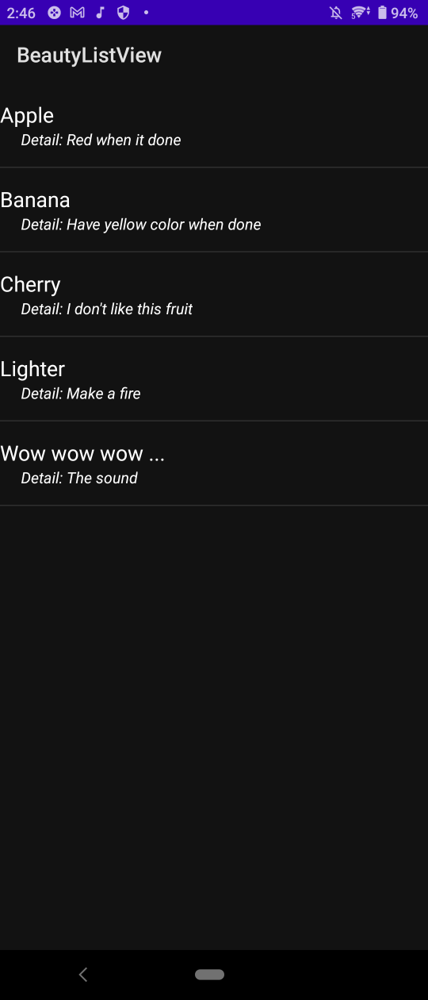
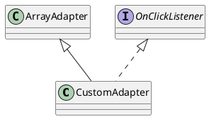

# Custom ListView

## ListView Custom

__Custom ListView__ là cách thay đổi thành phần của từng phần tử trong __ListView__, biến danh sách trở thành một danh sách mới tuỳ chỉnh thú vị hơn. Trước tiên làm ví dụ đơn giản làm ví dụ, một __ListView__ với _tiêu đề_ và _chú thích_.

<figure markdown="span">
    
    <figcaption>ListView example</figcaption>
</figure>

## CustomAdapter

Đàu tiên biết rằng, để một ListView tải ra một danh sách cần có một __ArrayAdapter__, điều này lúc đầu khá phiền phức nhưng sau đó mình mới hiểu nó có tác dụng gì. Để tạo một danh sách phần tử có thể sửa đổi cho __ListView__ thì
Đàu tiên cần tạo một _class_ kế thừa từ __ArrayAdapter__ và được phát triển từ __View.OnClickListener__. Trong đó có hai hàm dùng để __Override__.


Phần mã khởi tạo như này:

=== "Java"
    ```java
    public class CustomAdapter extends ArrayAdapter<Pair<String, String>> implements View.OnClickListener {

        @Override
        public void onClick(View view) {
            // Code
        }

        @Override
        public View getView(int position, View convertView, ViewGroup parent) {
            // Code
        }
    }
    ```

Sau đó thì bắt đầu tạo các thành phần đối tượng 

```java
public class CustomAdapter extends ArrayAdapter<Pair<String, String>> implements View.OnClickListener {
    private ArrayList<Pair<String, String>> mData;
    Context mContext;
    int mLayout = 0;

    // Construct
    public CustomAdapter(Context context, int resource, ArrayList<Pair<String,String>> data) {
        super(context, resource, data);
        this.mContext = context;
        this.mLayout = resource;
    }

    @Override
    public void onClick(View view) {
        // maybe nothing
    }


    @Override
    public View getView(int position, View convertView, ViewGroup parent) {
        if (convertView == null) {
            LayoutInflater inflater = LayoutInflater.from(mContext);
            convertView = inflater.inflate(mLayout, parent, false);
        }

        Pair<String, String> dataModel = getItem(position);
        TextView textView1 = (TextView) convertView.findViewById(R.id.text1);
        TextView textView2 = (TextView) convertView.findViewById(R.id.text2);
        if(null!=dataModel.first) {
            textView1.setText(dataModel.first);
        }
        if(null!=dataModel.second) {
            textView2.setText(dataModel.second);
        }
        // Return the completed view to render on screen
        return convertView;
    }
}
```

```java
    ArrayList<Pair<String,String>> list = new ArrayList<Pair<String,String>>();
    list.add(new Pair<String, String>("Apple", "Detail: Red when it done"));
    list.add(new Pair<String, String>("Banana", "Detail: Have yellow color when done"));
    list.add(new Pair<String, String>("Cherry", "Detail: I don't like this fruit"));
    list.add(new Pair<String, String>("Lighter", "Detail: Make a fire"));
    list.add(new Pair<String, String>("Wow wow wow ...", "Detail: The sound"));


    CustomAdapter adapter = new CustomAdapter(
        getApplicationContext(),
        R.layout.listview_custom_1,
        list
    );

    ListView listView = findViewById(R.id.listview);
    listView.setAdapter(adapter);
```