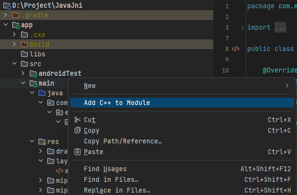
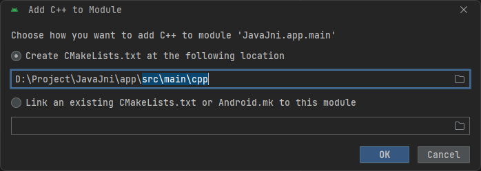

# Android JNI

!!! suggest "Tổng quát"
    Trong bài này tôi sẽ hướng dẫn tạo __JNI__ trong __Android Studio__

## JNI là gì?

__Java Native Interface__ (`JNI`) là một khung lập trình cho phép mã Java chạy trong _"máy ảo Java"_ __Java Virtual Machine__ (`JVM`) Để tương tác với các ứng dụng và thư viện được viết bằng các ngôn ngữ lập trình khác, chẳng hạn như `C`, `C++`, và `assembly`. Nó là một phần cơ bản của __Java Development Kit__ (`JDK`).

_Ngắn gọn hơn. **JNI** để bạn sử dụng code **C/C++** trong ngôn ngữ **Java**._

## Tạo module C++

Trong Android Studio có hỗ trợ lựa chọn này để tạo nhanh module __C++__

<figure markdown="span">
    
    <figcaption>Add C++ to Module</figcaption>
</figure>

Thông thường, mọi _module C++_ sẽ được thêm vào đường dẫn `src\main\cpp`

<figure markdown="span">
    
    <figcaption></figcaption>
</figure>

Cấu trúc trong thư mục `cpp` nó như này:

```bash
.(cpp)
├── CMakeLists.txt
└── javajni.cpp
```

Nội dung các tệp về cơ bản _(loại bỏ các comments)_ sẽ như thế này:

```bash title="CMakeLists.txt"
cmake_minimum_required(VERSION 3.22.1)
project("javajni")

add_library(${CMAKE_PROJECT_NAME} SHARED
    javajni.cpp)

target_link_libraries(${CMAKE_PROJECT_NAME}
    android
    log)
```

- `project("javajni")`: Dòng náy sẽ cài đặt tên cho dự án là `javajni`. Cái tên này sẽ được dùng để làm __*tên thư viện*__ cho __Java__ gọi đến. Vì thế cái tên có thể thay đổi, nhưng trong mã Java cần sửa đổi.
- `add_library`: dùng để khai báo các _source_ thêm vào. Ở đây `javajni.cpp` là tệp mã nguồn __C++__.
- `target_link_libraries`: mình không rõ cái này để làm gì lắm.

```bash title="javajni.cpp"
// No content
```

Và trong tệp `build.gradle` sẽ được thêm vào cấu hình như này:

```patch title="build.gradle"
    defaultConfig {
        applicationId "com.example.javajni"
        minSdk 30
        targetSdk 34
        versionCode 1
        versionName "1.0"

+        testInstrumentationRunner "androidx.test.runner.AndroidJUnitRunner"
+        externalNativeBuild {
+            cmake {
+                cppFlags ''
+            }
+        }
    }
```

```patch
    compileOptions {
        sourceCompatibility JavaVersion.VERSION_1_8
        targetCompatibility JavaVersion.VERSION_1_8
    }
+    externalNativeBuild {
+        cmake {
+            path file('src/main/cpp/CMakeLists.txt')
+            version '3.22.1'
+        }
+    }
```

## Gọi hàm JNI

### Viết Hàm

Trong tệp `javajni.cpp` tạo hàm như thế này:

```cpp title="javajni.cpp"
#include <jni.h>
#include <string>

extern "C" JNIEXPORT jstring JNICALL
Java_com_example_javajni_MainActivity_stringFromJNI(JNIEnv* env, jobject /* this */) {
    std::string hello = "Hello World";
    return env->NewStringUTF(hello.c_str());
}
```

- `extern`: là phần mở rộng hàm của `C` sang toàn bộ _module_.
- `JNIEXPORT` và `JNICALL`: chỉ là một __*keyword*__ dùng để xài được __JNI__ thôi.
- `jstring`: là loại biến được trả về của hàm trong __JNI__
- `Java_com_example_javajni_MainActivity_stringFromJNI`, phần này có cấu tạo ba phần:
    - Phần 1: `Java`, chính là tên của ngôn ngữ.
    - Phần 2: `com_example_javajni_MainActivity`, chính là tên gói được sử dụng, được tách ra từ `com.example.javajni.MainActivity`
    - Phần 3: `stringFromJNI`, là tên hàm.

### Dùng hàm

Ok giờ sang hàm bên __Java__ và gọi hàm từ __JNI__:

```java title="MainActivity.java"
public class MainActivity extends AppCompatActivity {
    // Declare native method
    public native String stringFromJNI();
 
     static {
        // Load native library
        System.loadLibrary("javajni");
    }

    @Override
    protected void onCreate(Bundle savedInstanceState) {
        super.onCreate(savedInstanceState);
        setContentView(R.layout.activity_main);

        TextView textview = findViewById(R.id.textview);
        textview.setText(stringFromJNI());
    }
}
```

- `javajni` được dùng  ở dòng tải thư viện chính  là tên của thư viện được sử dụng trong `CMakeLists.txt`

!!! success "Kết quả"
    `stringFromJNI()` sẽ trả ra kết quả là một chuỗi __String__ là `"Hello World"`.

## Thư viện

Nếu chạy được thành công, tức là __mọi thứ đều ổn__.

Nếu __mọi thứ đều ổn__, chắc chắn sẽ có tệp thư viện. Và nó sẽ nằm ở `app\build\intermediates\cxx\` khi bạn dùng lệnh để tìm kiếm tệp `.so` _(tệp thư viện của **C++**)_

```txt
.\Project\JavaJni\app\build\intermediates\cxx\Debug\3v662q1i\obj\arm64-v8a\libjavajni.so
.\Project\JavaJni\app\build\intermediates\cxx\Debug\3v662q1i\obj\armeabi-v7a\libjavajni.so
.\Project\JavaJni\app\build\intermediates\cxx\Debug\3v662q1i\obj\x86\libjavajni.so
.\Project\JavaJni\app\build\intermediates\cxx\Debug\3v662q1i\obj\x86_64\libjavajni.so
.\Project\JavaJni\app\build\intermediates\cxx\Debug\481h3k06\obj\arm64-v8a\libnative-jni.so
.\Project\JavaJni\app\build\intermediates\cxx\Debug\481h3k06\obj\armeabi-v7a\libjavajni.so
.\Project\JavaJni\app\build\intermediates\cxx\Debug\481h3k06\obj\x86_64\libjavajni.so
.\Project\JavaJni\app\build\intermediates\merged_native_libs\debug\out\lib\arm64-v8a\libnative-jni.so
.\Project\JavaJni\app\build\intermediates\stripped_native_libs\debug\out\lib\arm64-v8a\libnative-jni.so
```

## Tổng kết

!!! info "Tổng kết"
    1. JNI dùng để chạy __C/C++__ trong __Java__ thông qua thư viện  `libNAME.so`
    1. Để chạy được __JNI__ cần dùng __2__ loại tệp:
        - `CMakeList.txt`
        - `source_code.cpp`
    1. Khai báo thẻ `externalNativeBuild` vào tệp `app/build.gradle`
    1. Khai báo thẻ `System.loadLibrary("NAME")` vào tệp `MainActivity.java` và các hàm _native_. Sau đó sử dụng như bình thường.