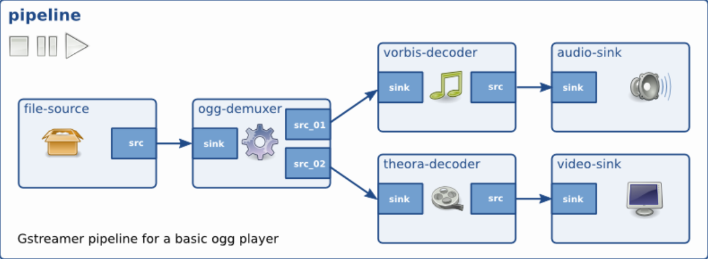
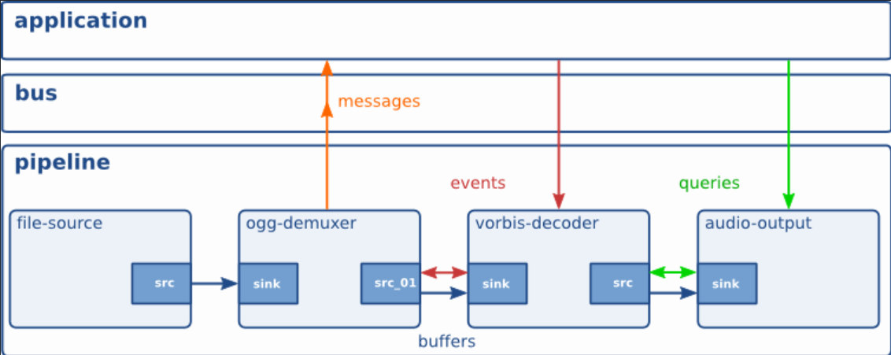

# Foundations

Các khái niệm cơ bản xem ở đây [Foundations](https://gstreamer.freedesktop.org/documentation/application-development/introduction/basics.html?gi-language=c)

## Elements

Đối tượng cơ bản

## Bins

## Bus

## Pads and capabilities

## Buffers and Events

<figure markdown="span">
    
    <figcaption></figcaption>
</figure>

<figure markdown="span">
    
    <figcaption></figcaption>
</figure>