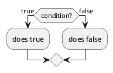

# Flow Control

## if/else

`if/else` đơn giản là kiểm tra đúng sai, luồng đơn giản như này:



Nếu `condition` _(điều kiện)_ là đúng thì sẽ thực hiện `[does true]`, còn lại sai thì là `[does false]`. Mã mẫu như sau:

```cpp
bool condition = true; // else false

if(condition) {
    // does true
} else {
    // does false
}
```
## for

`for` là vòng lặp, chạy 

```cpp
for(int i=0; i<10; ++i) {
    std::cout << i << " ";
}
```

Kết quả:

```bash
0 1 2 3 4 5 6 7 8 9
```

## while

`while` nghĩa là vòng lặp có điều kiện:

```bash
int count = 0;

while(count < 10) {
    count = count + 1;
}
```
```bash
0 1 2 3 4 5 6 7 8 9
```
Dòng lệnh đó thực hiện như sau:
- `count` khởi động với giá trị bằng `0`
- Sau đó vì `count < 10`, điều kiện vẫn đúng nên sẽ thực hiện dòng lệnh trong dấu `{}`
- Dòng lệnh `count = count + 1` là chính giá trị đó được tự tăng lên `1`.
- Sau đó đến khi `count` đến `10` thì sẽ thoát vòng lặp

## goto

`goto` cần một _nhãn dán_ được đặt tên, hãy xem qua ví dụ dưới này:

```cpp
int main()
{
    int count = 0;

    while(true) {
        if(count > 10) {
            goto example_label;
        }
        count = count + 1;
    }
example_label:
    return 0;
}
```

- Hàm này sẽ thực hiện gần như hàm ___while___ ở trên trừ một điểm, điều kiện là `true` tức là vòng lặp vô hạn.
- Với điều kiện `(count > 10)` đoạn trong này sẽ không được thực hiện trong khi biến `count` còn nhỏ hơn `10`
- Khi `count` tiến đến giá trị `10`, sẽ thực hiện đoạn mã `goto example_label;`
- `goto example_label;` sẽ dẫn đến nhãn ___example_label___
- Đoạn này sẽ thoát khỏi vòng lặp `while` và thoát ra khỏi chương trình.