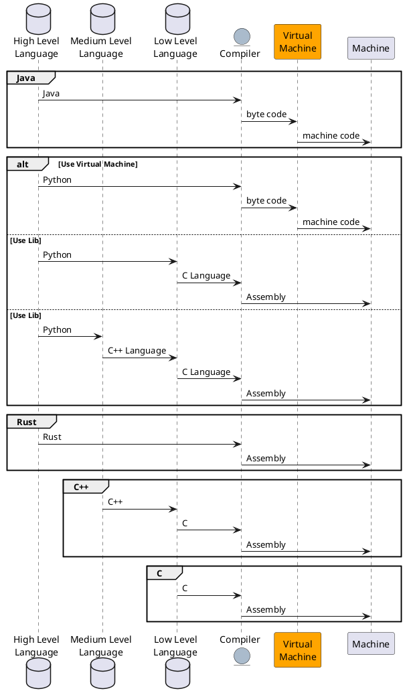
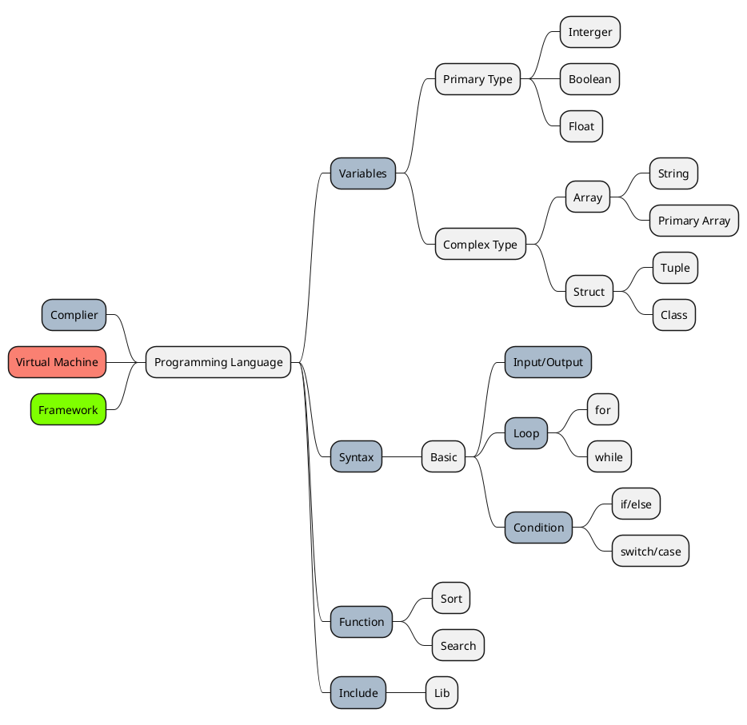

# Overview

## Các ngôn ngữ

<div class="grid cards" markdown>

- C
- C++
- C#
- Java
- Python
- Kotlin
- Rust
- PHP

</div>

## Biên dịch hay Thông dịch?

### Các tầng của ngôn ngữ máy tính
- Vì ngôn ngữ lập trình cuối cùng là để giao tiếp với máy tính nên nhất định phải sử dụng "ngôn ngữ máy".
- Ngôn ngữ máy cấp thấp nhất là những chuỗi `bit` dạng `01010111...` chính là những tín hiệu điện với điều kiện mặc định là 1=có điện, 0=không có điện.
- Tiếp đến, khá gần được gọi là __Assembly Language (ASM)__ hoặc còn gọi là `hợp ngữ`. Một kiểu cực kỳ gần với ngôn ngữ máy rồi và hầu hết các hệ điều hành đểu có thể đọc được chúng. Ở dạng trung bình, hợp ngữ vẫn tạm coi như là có thể đọc được nhưng cần kiến thức nền tảng về máy tính khá tốt, một ví dụ về hợp ngữ như sau:

```asm
MOV  AX, 00    ; Initializing AX to 0
MOV  BX, 00    ; Initializing BX to 0
MOV  CX, 01    ; Initializing CX to 1
L20:
ADD  AX, 01    ; Increment AX
ADD  BX, AX    ; Add AX to BX
SHL  CX, 1     ; shift left CX, this in turn doubles the CX value
JMP  L20       ; repeats the statements
```

- Tầng kế tiếp này mới là tầng được sử dụng khá nhiều và còn được thông dụng gọi là _ngôn ngữ lập trình_. Ở tầng này đã đơn giản hoá đi rất nhiều và cố gắng được trình bày dưới dạng ngôn ngữ thông dụng. Với hai lớp chính được chia không rõ ràng là __ngôn ngữ bậc thấp__ và __ngôn ngữ bậc cao__. Ngôn ngữ bậc thấp (ví dụ như `C`) vẫn còn nhiều khả năng kết nối với tầng dưới. Càng gần ngôn ngữ bậc cao, các tính năng càng được đơn giản và trình bày giống __ngôn ngữ nói hoặc băn bản__.

Vấn đề của _ngôn ngữ lập trình (NNLT)_ nói chung xoay quanh chuyện `dịch ngôn ngữ`.

Để hiểu khái niệm này, trước hết cần phải có các tệp văn bản viết theo NNLT được gọi là ___script___ _(kịch bản)_.
Máy tính không hiểu các kịch bản này, nó cần một người chuyển nó sang dạng cuối cùng là ngôn ngữ máy cấp thấp, và trong lĩnh vực máy tính chia ra làm hai khái niệm là biên dịch _(compiler)_ và thông dịch _(interpreter)_.

- Với biên dịch, ___script___ được soạn thành tệp thực thi trực tiếp ví dụ như trò chơi điện tử hoặc là chương trình mn hay dùng có đuôi là `.exe` trên Windows. Các tệp đó có thể chạy, nhưng các bạn không thể đọc vì nó đã là ngôn ngữ máy. Nếu cố gắng mở nó ở dạng văn bản thì nó sẽ thành kiểu `00101010...`. Tiêu chí của phương pháp này là <mark>_dịch một lần chạy mãi mãi_</mark>

- Thông dịch như tên gọi, thay vì biên dịch cả nó sẽ biên dịch một phần, đọc đến đâu dịch đến đó, vừa chạy vừa dịch. Nhược điểm chính là tốc độ về trung bình sẽ chậm hơn, đầu thời tuỳ theo cách phát triển nhưng lần nào chạy cũng gần như phải dựng lại. Thông dịch cũng có 2 loại chính:
    - Phân loại theo cách chạy
        - __Không sử dụng máy ảo (VM)__: Tức là dịch trực tiếp thành mã máy và sử dụng không qua máy ảo. Cách này khá rắc rối và tiềm tàng nhiều nguy hiểm nên mãi gần đây chỉ có Android là sử dụng lại. Còn lại hầu như đều không sử dụng cách này
        - __Sử dụng máy ảo (VM)__: Sử dụng máy ảo sẽ tiết kiệm hơn, tức là ngôn ngữ vẫn được biên dịch nhưng sẽ thành ngôn ngữ của máy ảo, máy ảo sẽ chạy chương trình đầu ra trên máy thật. Cách này rất được ưa chuộng và phổ biến trên `Java`, `Python` bởi vấn đề chỉ xoay quanh máy ảo và môi trường thiết bị, các vấn đề liên quan không còn bị tác động.
    - Phân loại theo cách dịch
        - __Biên dịch qua một ngôn ngữ trung gian__ _(dùng cho máy ảo)_: Như ở trên trình bày, sẽ có một chương trình biên dịch một phần hoặc toàn bộ ngôn ngữ qua ngôn ngữ trung gian rồi mới chạy trên máy ảo. Điều này tuỳ thuộc vào người dùng.
        - __Không qua ngôn ngữ trung gian__ _(vẫn dùng cho máy ảo hoặc không)_: Cách này vẫn là biên dịch một phần, chỉ có điều là để tiết kiệm bộ nhớ và tăng mạnh khả năng chương trình, một số phương pháp có thể biên dịch trực tiếp một phần thành mã máy và sử dụng mà không qua ngôn ngữ trung gian nữa.

> Hầu hết các ngôn ngữ thông dịch đều là NNLT bậc cao.
> Các ngôn ngữ bậc cao có thể dịch thành các ngôn ngữ cấp thấp hơn và xuống dưới, không nhất thiết phải luôn đi trực tiếp xuống ngôn ngữ máy.

#### So sánh

|                     | Compiler - _Ngôn ngữ biên dịch_ | Iterpreter - _Ngôn ngữ thông dịch_ |
| :------------------ | :-----------------------------: | :--------------------------------: |
| Tốc độ dịch         |              Chậm               |              `Nhanh`               |
| Tốc độ chương trình |             `Nhanh`             |                Chậm                |
| Bộ nhớ              |            `Tối ưu`             |                 Tệ                 |
| Đa nền tảng         |               Kém               |               `Tốt`                |
| Tốc độ khởi động    |               Kém               |               `Tốt`                |
| Tính ổn định        |              `Tốt`              |                Kém                 |



## Các thành phần cơ bản của ngôn ngữ lập trình



!!! note "Tổng kết"
    Hầu như mọi loại ngôn ngữ lập trình đều tồn tại cơ bản `4 yếu tố`:

    1. __Complier/Interpret__ : Biên dịch / Thông dịch
    1. __Variables__ : Biến
    1. __Syntax__ : Cú pháp
        - __In/Out__ : Đầu vào, ra
        - __Conditionals__ : Điều kiện
        - __Loops__ : Vòng Lặp
    1. __Function__ : Hàm
    1. __Include__ : Bao gồm, tải tệp, tải thư viện

- __Complier/Interpret__: Chuyển đổi ngôn ngữ thành ngôn ngữ máy.
- __Biến__: các biến trong lập trình cho biết cách biểu diễn dữ liệu, có thể nằm trong phạm vi từ giá trị rất đơn giản đến giá trị phức tạp. Giá trị chúng chứa có thể thay đổi tùy theo điều kiện. Như chúng ta đã biết, chương trình bao gồm các hướng dẫn yêu cầu máy tính thực hiện mọi việc và dữ liệu mà chương trình sử dụng khi nó đang chạy. Dữ liệu không đổi với các giá trị cố định hoặc biến. Chúng có thể chứa một giá trị rất đơn giản như độ tuổi của một người cho đến một thứ rất phức tạp như thành tích học tập của học sinh trong cả năm.
- __Syntax__: Cú pháp cơ bản để thực hiện một số ý đồ đơn giản nhất về _logic_
    - __Đầu vào/đầu ra__: thành phần lập trình máy tính cho phép chương trình tương tác với các thực thể bên ngoài. Ví dụ về phần tử đầu vào/đầu ra đang in nội dung nào đó ra màn hình đầu cuối, ghi lại một số văn bản mà người dùng nhập trên bàn phím và có thể bao gồm việc đọc và ghi tệp. Hãy lấy một ví dụ về ngôn ngữ để hiểu khái niệm đầu vào và đầu ra. C++ sử dụng các luồng để thực hiện thao tác đầu vào và đầu ra trong phương tiện tuần tự dưới dạng màn hình, bàn phím hoặc tệp. Chúng ta có thể định nghĩa luồng là một thực thể có thể chèn hoặc trích xuất các ký tự và không cần biết chi tiết về phương tiện được liên kết với luồng hoặc bất kỳ thông số kỹ thuật nội bộ nào của nó. Chúng ta cần biết về luồng là chúng là nguồn hoặc đích của các ký tự và các ký tự được chấp nhận một cách tuần tự.
    - __Điều kiện__: điều kiện chỉ định việc thực hiện các câu lệnh tùy thuộc vào việc điều kiện có được thỏa mãn hay không. Về cơ bản, nó đề cập đến một hành động chỉ thực hiện khi điều kiện áp dụng theo hướng dẫn được thỏa mãn. Chúng là một trong những thành phần quan trọng nhất của ngôn ngữ lập trình vì chúng cho phép chương trình tự do hành động khác nhau mỗi khi thực thi, điều này tùy thuộc vào đầu vào của lệnh.
    - __Vòng lặp__: chúng ta có thể định nghĩa vòng lặp là một chuỗi các lệnh được lặp lại liên tục cho đến khi một điều kiện nhất định không được thỏa mãn. Cách bắt đầu vòng lặp hiểu điều này trước tiên, một quy trình nhất định được thực hiện, để lấy bất kỳ dữ liệu nào và thay đổi nó sau khi điều kiện áp dụng đó trên vòng lặp được kiểm tra xem bộ đếm có đạt đến số quy định hay không. Về cơ bản, một vòng lặp thực hiện việc thực hiện một nhóm lệnh với số lần nhất định. Ngoài ra còn có một khái niệm về vòng lặp vô hạn, còn được gọi là vòng lặp vô tận, là một đoạn mã thiếu lối thoát chức năng và sẽ lặp lại vô thời hạn.
- __Hàm__: thành phần của chương trình cho phép lập trình viên sử dụng đoạn mã vào một vị trí có thể được sử dụng nhiều lần. Mục đích chính của các hàm là lấy các đối số theo số lượng giá trị và thực hiện một số phép tính trên chúng sau đó trả về một kết quả duy nhất. Các hàm được yêu cầu khi bạn cần thực hiện các phép tính phức tạp và kết quả của việc đó có thể được sử dụng hoặc không được sử dụng sau đó trong một biểu thức. Nếu chúng ta nói về các chương trình con trả về một số kết quả. Trường hợp không thể đặt lệnh gọi đến chương trình con trong một biểu thức cho dù nó nằm trong chương trình chính nơi chương trình con được kích hoạt bằng cách sử dụng câu lệnh CALL bao gồm danh sách đầu vào và đầu ra được đặt trong dấu ngoặc đơn mở và đóng và chúng được gọi là đối số của chương trình con . Có một số quy tắc được cả hai tuân theo để xác định tên như ít hơn sáu chữ cái và bắt đầu bằng các chữ cái. Tên phải khác với tên được sử dụng cho các biến và hàm.

!!! note "Tổng kết"
    Vậy nên, mỗi lần học về ngôn ngữ lập trình này đó cần đi qua đủ 6 bài cơ bản về:
    1. __Complier/Interpret__ : Biên dịch / Thông dịch
    1. __Variables__ : Biến
    1. __Syntax__ : Cú pháp
        - __In/Out__ : Đầu vào, ra
        - __Conditionals__ : Điều kiện
        - __Loops__ : Vòng Lặp
    1. __Function__ : Hàm
    1. __Include__ : Bao gồm, tải tệp, tải thư viện