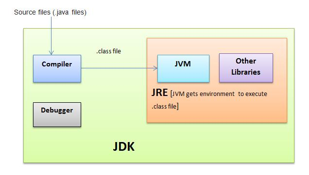

# JDK, JRE và JVM

## Tổng quan

Hiểu được sự khác biệt giữa JDK, JRE và JVM đóng vai trò rất quan trọng trong việc hiểu cách Java hoạt động và cách mỗi thành phần đóng góp vào quá trình phát triển và thực thi các ứng dụng Java. Sự khác biệt chính giữa JDK, JRE và JVM là:

- [JDK](https://www.geeksforgeeks.org/jdk-in-java/) : Java Development Kit là môi trường phát triển phần mềm được sử dụng để phát triển các ứng dụng và applet Java.
- [JRE](https://www.geeksforgeeks.org/jre-in-java/) : JRE là viết tắt của Java Runtime Environment  và nó cung cấp môi trường để chỉ chạy chương trình Java trên hệ thống.
- [JVM](https://www.geeksforgeeks.org/jvm-works-jvm-architecture/) : JVM là viết tắt của Java Virtual Machine và chịu trách nhiệm thực thi chương trình Java.

| Diện mạo           | JDK                                                           | JRE                                                 | Máy ảo JVM                                                                        |
| :----------------- | :------------------------------------------------------------ | :-------------------------------------------------- | :-------------------------------------------------------------------------------- |
| Mục đích           | Được sử dụng để phát triển các ứng dụng Java                  | Được sử dụng để chạy các ứng dụng Java              | Chịu trách nhiệm chạy mã Java                                                     |
| Phụ thuộc nền tảng | Phụ thuộc vào nền tảng                                        | Phụ thuộc vào nền tảng                              | Nền tảng độc lập                                                                  |
| Bao gồm            | Nó bao gồm các công cụ phát triển như (trình biên dịch) + JRE | Nó bao gồm các thư viện để chạy ứng dụng Java + JVM | Nó chạy mã byte Java và làm cho ứng dụng Java có thể hoạt động trên mọi nền tảng. |
| Trường hợp sử dụng | Viết và biên dịch mã Java                                     | Chạy ứng dụng Java trên hệ thống                    | Chuyển đổi bytecode thành mã máy gốc                                              |

<figure markdown="span">
    
    <figcaption>Tổng quát về JDK, JRE và JVM</figcaption>
</figure>

!!! warning "Lưu ý"
    Lưu ý: JVM không phụ thuộc vào nền tảng, nhưng JVM triển khai khác nhau ở mỗi nền tảng vì nó tương tác với hệ điều hành gốc và phần cứng. Vì vậy, trên thực tế, nó phụ thuộc vào nền tảng .

## JVM

- __JVM__ _(Java Virtual Machine)_ là _máy ảo_ tạo ra môi trường máy ảo để thực thi mã _java bytecode_.
- __Máy ảo Java__ là phần mềm giả lập máy tính, nó tập hợp các lệnh logic để xác định hoạt động của máy. Có thể xem nó như là một hệ điều hành thu nhỏ.
- __JVM__ chuyển mã byte code thành machine code tùy theo môi trường tương ứng (gọi là khả năng khả chuyển)
- __JVM__ cung cấp môi trường thực thi cho chương trình Java (gọi đó là khả năng độc lập với nền).
- __JVM__ có sẵn trong nhiều phần cứng và nền tảng phần mềm.

JVM gồm <u>__4 nhiệm vụ chính__</u>:

1. Load code
1. Verifies code
1. Executes code
1. Provides runtime enviroment

## JDK

### JDK là

> **JDK** là _Java Development Kit_, là môi trường phát triển phần mềm được sử dụng để phát triển các ứng dụng và applet ___Java___.

__Java Development Kit (JDK)__ là một môi trường phát triển phần mềm đa nền tảng cung cấp một bộ công cụ và thư viện cần thiết để phát triển các ứng dụng phần mềm và applet dựa trên Java. Đây là một gói cốt lõi được sử dụng trong Java, cùng với _JVM (Java Virtual Machine)_ và _JRE (Java Runtime Environment)_. 

Người mới bắt đầu thường bị nhầm lẫn giữa JRE và JDK, nếu bạn chỉ quan tâm đến việc chạy các chương trình Java trên máy của mình thì bạn có thể dễ dàng thực hiện bằng Java Runtime Environment. Tuy nhiên, nếu bạn muốn phát triển một ứng dụng phần mềm dựa trên Java thì cùng với JRE, bạn có thể cần một số công cụ cần thiết bổ sung, được gọi là JDK.

JDK=JRE+Công cụ phát triển

### Nội dung của JDK

JDK có Máy ảo Java (JVM) riêng và một số tài nguyên khác cần thiết cho việc phát triển Ứng dụng Java. 

JDK bao gồm:

1. Môi trường chạy Java (JRE),
1. Trình thông dịch/trình tải (Java),
1. Một trình biên dịch (javac),
1. Một trình lưu trữ (jar) và nhiều hơn nữa.
1. Java Runtime Environment trong JDK
    - Thường được gọi là __Private Runtime__ vì nó tách biệt với __JRE__ thông thường và có thêm nội dung.
    - __Private Runtime__ trong JDK chứa JVM và tất cả các thư viện lớp có trong môi trường sản xuất, cũng như các thư viện bổ sung hữu ích cho nhà phát triển, ví dụ như thư viện quốc tế hóa và thư viện IDL.

### Các JDK phổ biến nhất

- __Oracle JDK__: JDK phổ biến nhất và là nhà phân phối chính của Java11,
- __OpenJDK__: Sẵn sàng sử dụng: JDK 15, JDK 14 và JMC,
- __Azul Systems Zing__: JDK hiệu quả và độ trễ thấp cho hệ điều hành Linux,
- __Azul Systems__: thương hiệu Zulu dựa trên Linux, Windows, Mac OS X,
- __IBM J9 JDK__: dành cho AIX, Linux, Windows và nhiều hệ điều hành khác,
- __Amazon Corretto__: tùy chọn mới nhất với bản dựng OpenJDK miễn phí và hỗ trợ dài hạn.

### Cài đặt

#### Cài đặt JDK

Việc thiết lập JDK trong môi trường phát triển của bạn cực kỳ dễ dàng, chỉ cần làm theo các bước đơn giản dưới đây. 

- Truy cập [Trang Tải xuống chính thức của Oracle thông qua liên kết này](https://www.oracle.com/in/java/technologies/)
- Chọn phiên bản JDK mới nhất và nhấp vào Tải xuống rồi thêm vào classpath của bạn.
-  Chỉ cần kiểm tra xem phần mềm JDK đã được cài đặt đúng vị trí trên máy tính của bạn hay chưa, ví dụ: `C:\Program Files\Java\jdk11.0.9`.

#### Đặt JAVA_HOME cho Windows

#### Đặt JAVA_HOME cho Linux

```bash
export JAVA_HOME=~/../../../../
```

## JRE
