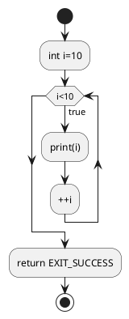
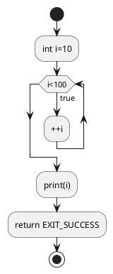

# Condition And Loop

## Condition

### Phép toán so sánh

#### if
Điều kiện xoay quanh biến `bool` và hàm `if`\
Biến bool cũng có thể hiểu là một số với mặc định:
- `true`  = 1
- `false` = 0

Thử đoạn code sau: 

```c++ title="main.cpp"
int main()
{
	bool A = true;
	bool B = false;
	if(A) {
		std::cout << "Value of A: " << A; // Because A=true, code work in here
	}
	if(B) {
		std::cout << "Value of B: " << B; // code not run in here
	}
	return EXIT_SUCCESS; 
}
```
```bash
Value of A: 1
```
Ngoài ra, các số khác `0` cũng được tính là `true`.

#### if/else

Có một kiểu khác của `if` là `if-esle`. Nghĩa là nếu if sai thì vào trường hợp còn lại.

```c++ title="main.cpp"
int main()
{
	bool A = false;
	if(A) {
		std::cout << "Value if A: " << A; // Because A=true, code work in here
	} else {
		std::cout << "Value else A: " << A; // code not run in here
	}
	return EXIT_SUCCESS; 
}
```
```bash
Value else A: 0
```

### Phép toán so sánh

#### So sánh bằng
So sánh bằng dùng dấu `==`
```c++ title="main.cpp"
int main()
{
	int a = 1;
	int b = 2;
	if(a==b) {
		std::cout << "a = b";
	} else {
		std::cout << "a != b";
	}
	return EXIT_SUCCESS; 
}
```
```bash
a != b
```
Ngược lại, sử dụng `!=` nếu muốn kiểm tra không giống.
```c++ title="main.cpp"
int main()
{
	int a = 1;
	int b = 2;
	if(a!=b) {
		std::cout << "a != b";
	} else {
		std::cout << "a == b";
	}
	return EXIT_SUCCESS; 
}
```
```bash
a != b
```

#### and/or

- Với phép so sánh và ___(AND)___, cả hai điều kiện so sánh đều phải đúng.
	- So sánh ___(AND)___ dùng dấu `&&`
- Với phép so sánh và ___(OR)___, chỉ cần một điều kiện đúng.
	- So sánh ___(OR)___ dùng dấu `||`
- Có thể nhiều hơn hai vế, và phép so sánh có thể 

```c++ title="main.cpp"
int main()
{
	bool A = true;
	bool B = false;
	std::cout << A&&B << std::endl; // false
	std::cout << A||B << std::endl; // true
	return EXIT_SUCCESS; 
}
```
```bash
0
1
```

#### Phép đảo
Phép đảo để đảo ngược kết quả. Ví dụ muốn kiểm tra với _Điều kiện A không đúng_.

```c++ title="main.cpp"
int main()
{
	bool A = true;
	if(!A) {
		std::cout << A;
	}

	return EXIT_SUCCESS; 
}
```
```bash
1
```
## Vòng lặp

<u>__Vòng lặp điều kiện__</u> và <u>__Vòng lặp trong khoảng__</u>

### Vòng lặp trong khoảng

- Vòng lặp trong khoảng là `for`. Vòng lặp sẽ kết thúc với điều kiện theo biến đầu `i`.
	- `int i=0;` : Biến `i` khởi tạo bắt đầu từ giá trị `0`
	- `i<10;`: Điều kiện thoát là nhỏ hơn `10`
	- `++i`: Tăng thêm một giá trị sau khi hết vòng lặp
	- Chương trình chính thực hiện trong `{}`
```c++ title="main.cpp"
int main()
{
	for(int i=0; i<10; ++i) {
		std::cout << i << std::endl;
	}
	return EXIT_SUCCESS; 
}
```
```bash
0
1
2
3
4
5
6
7
8
9
```
Tiến trình vòng lặp __FOR__ như sau:



### Vòng lặp điều kiện

<u>__Vòng lặp điều kiện__</u> sử dụng cú pháp `while` và thoát chỉ với 1 điều kiện. Cho đến khi nào điều kiện chưa được thoả mãn thì còn trong vòng lặp `{}`.

```c++ title="main.cpp"
int main()
{
	int i=0;
	while(i<100) {
		// Do code in here
		++i;
	}
	std::cout << i << std::endl;
	return EXIT_SUCCESS; 
}
```
Chương trình thoát với điều kiện cho đến khi biến `i` đến giá trị `100`
```bash
100
```
Vòng lặp có sơ đồ như sau:



<u>__Vòng lặp điều kiện__</u> cũng có thể được sử dụng cùng chức năng với `for` như sau:

```c++ title="main.cpp"
int main()
{
	int i=0;
	for(;i<100;;) {
		// Do code in here
		++i;
	}
	std::cout << i << std::endl;
	return EXIT_SUCCESS; 
}
```