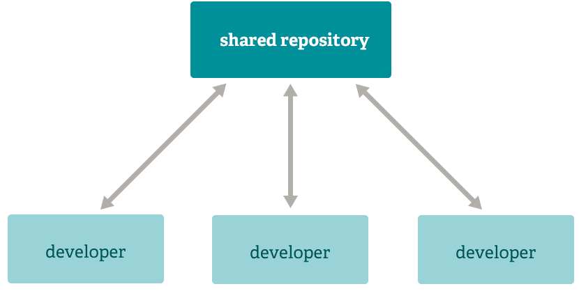

# About Git

> - Git là một hệ thống kiểm soát phiên bản phân tán <u style="color:red">mã nguồn mở</u> và <u style="color:red">miễn phí</u> được thiết kế để xử lý mọi thứ từ các dự án nhỏ đến rất lớn với tốc độ và hiệu quả.
> - Git rất dễ học và có dung lượng nhỏ với hiệu suất nhanh như chớp. Nó vượt trội hơn các công cụ SCM như Subversion, CVS, Perforce và ClearCase với các tính năng như phân nhánh cục bộ giá rẻ , khu vực tổ chức thuận tiện và nhiều quy trình làm việc.
> - Git có bản thương mại.
> - Git cực kỳ phổ biến. Với tính năng cơ bản là quản lý code và các phiên bản.

## Branching and Merging

> Phân nhánh và sáp nhập

Tính năng Git thực sự khiến nó nổi bật so với hầu hết các SCM khác hiện có là mô hình phân nhánh của nó.

Git cho phép và khuyến khích bạn có nhiều nhánh cục bộ có thể hoàn toàn độc lập với nhau. Việc tạo, hợp nhất và xóa các dòng phát triển đó chỉ mất vài giây.

Điều này có nghĩa là bạn có thể làm những việc như:

Chuyển đổi bối cảnh không ma sát. Tạo một nhánh để thử một ý tưởng, cam kết một vài lần, quay lại nơi bạn đã phân nhánh, áp dụng một bản vá, quay lại nơi bạn đang thử nghiệm và hợp nhất nó vào.
Codeline dựa trên vai trò. Có một nhánh luôn chỉ chứa những gì được đưa vào sản xuất, một nhánh khác mà bạn hợp nhất công việc vào để thử nghiệm và một số nhánh nhỏ hơn dành cho công việc hàng ngày.
Quy trình làm việc dựa trên tính năng. Tạo các nhánh mới cho mỗi tính năng mới mà bạn đang làm việc để bạn có thể chuyển đổi qua lại giữa chúng một cách liền mạch, sau đó xóa từng nhánh khi tính năng đó được hợp nhất vào dòng chính của bạn.
Thử nghiệm dùng một lần. Tạo một nhánh để thử nghiệm, nhận ra rằng nó sẽ không hoạt động và chỉ cần xóa nó - từ bỏ công việc đó mà không ai khác nhìn thấy nó (ngay cả khi bạn đã đẩy các nhánh khác trong thời gian chờ đợi).
Chi nhánh

<figure markdown="span">
    
    <figcaption>Image caption</figcaption>
</figure>

Đáng chú ý, khi bạn đẩy tới một kho lưu trữ từ xa, bạn không phải đẩy tất cả các nhánh của mình. Bạn có thể chọn chỉ chia sẻ một trong các chi nhánh của mình, một vài chi nhánh hoặc tất cả các chi nhánh đó. Điều này có xu hướng giúp mọi người tự do thử nghiệm những ý tưởng mới mà không phải lo lắng về việc phải lập kế hoạch về cách thức và thời điểm họ sẽ hợp nhất hoặc chia sẻ nó với những người khác.

Có nhiều cách để thực hiện một số điều này bằng các hệ thống khác, nhưng công việc liên quan khó khăn hơn và dễ xảy ra lỗi hơn nhiều. Git làm cho quá trình này cực kỳ dễ dàng và nó thay đổi cách hầu hết các nhà phát triển làm việc khi họ tìm hiểu nó.

## Small and Fast

> Nhỏ và Nhanh

__Git rất nhanh.__

Với Git, gần như tất cả các hoạt động đều được thực hiện cục bộ, mang lại lợi thế lớn về tốc độ trên các hệ thống tập trung thường xuyên phải liên lạc với máy chủ ở đâu đó.

Git được xây dựng để hoạt động trên nhân Linux, nghĩa là nó phải xử lý hiệu quả các kho lưu trữ lớn ngay từ ngày đầu. Git được viết bằng C, giảm chi phí thời gian chạy liên quan đến các ngôn ngữ cấp cao hơn. Tốc độ và hiệu suất đã là mục tiêu thiết kế chính của Git ngay từ đầu.

__Benchmarks _(Điểm tiêu chuẩn)___

Git nhanh hơn khá nhiều so với các ứng dụng khác có cùng mục đích hoạt động.

## Distributed

> Phân phối

Một trong những tính năng thú vị nhất của bất kỳ SCM phân tán nào, bao gồm cả Git, là nó được phân phối. Điều này có nghĩa là thay vì thực hiện "kiểm tra" mẹo hiện tại của mã nguồn, bạn thực hiện "bản sao" toàn bộ kho lưu trữ.

### Nhiều bản sao lưu
Điều này có nghĩa là ngay cả khi bạn đang sử dụng quy trình làm việc tập trung thì về cơ bản mọi người dùng đều có bản sao lưu đầy đủ của máy chủ chính. Mỗi bản sao này có thể được đẩy lên để thay thế máy chủ chính trong trường hợp xảy ra sự cố hoặc hỏng hóc. Trên thực tế, không có điểm lỗi duy nhất nào với Git trừ khi chỉ có một bản sao duy nhất của kho lưu trữ.

### Workflow
Do tính chất phân tán và hệ thống phân nhánh tuyệt vời của Git, số lượng quy trình công việc gần như vô tận có thể được triển khai một cách tương đối dễ dàng.

#### Subversion-Style Workflow
Quy trình làm việc tập trung _(centralized workflow)_ rất phổ biến, đặc biệt là với những người chuyển đổi từ hệ thống tập trung. Git sẽ không cho phép bạn đẩy nếu ai đó đã đẩy kể từ lần cuối bạn tìm nạp, do đó, một mô hình tập trung nơi tất cả các nhà phát triển đẩy đến cùng một máy chủ sẽ hoạt động tốt.

<figure markdown="span">
        
    <figcaption>Quy trình làm việc a</figcaption>
</figure>

#### Integration Manager Workflow

Một quy trình công việc Git phổ biến khác liên quan đến người quản lý tích hợp - một người duy nhất cam kết với kho lưu trữ 'may mắn'. Sau đó, một số nhà phát triển sao chép từ kho lưu trữ đó, chuyển sang kho lưu trữ độc lập của riêng họ và yêu cầu nhà tích hợp thực hiện các thay đổi của họ. Đây là loại mô hình phát triển thường thấy với các kho lưu trữ mã nguồn mở hoặc GitHub.

<figure markdown="span">
        
    <figcaption>Quy trình làm việc b</figcaption>
</figure>

#### Dictator and Lieutenants Workflow

Đối với các dự án lớn hơn, quy trình phát triển như nhân Linux thường có hiệu quả. Trong mô hình này, một số người ('trung úy') phụ trách một hệ thống con cụ thể của dự án và họ hợp nhất trong tất cả các thay đổi liên quan đến hệ thống con đó. Một nhà tích hợp khác ('nhà độc tài') chỉ có thể lấy các thay đổi từ cấp dưới của mình và sau đó đẩy vào kho lưu trữ 'may mắn' mà mọi người sau đó sẽ sao chép lại từ đó.

<figure markdown="span">
        
    <figcaption>Quy trình làm việc c</figcaption>
</figure>

## Data Assurance

> Đảm bảo dữ liệu

Mô hình dữ liệu mà Git sử dụng đảm bảo tính toàn vẹn mật mã của từng bit trong dự án của bạn. Mọi tệp và cam kết đều được tổng kiểm tra và truy xuất bằng tổng kiểm tra của nó khi được kiểm tra lại. Không thể lấy được bất cứ thứ gì từ Git ngoài __những bit chính xác mà bạn đưa vào__.

<figure markdown="span">
        
    <figcaption>Data Assurance</figcaption>
</figure>

Cũng không thể thay đổi bất kỳ tệp, ngày tháng, thông báo cam kết hoặc bất kỳ dữ liệu nào khác trong kho Git mà không thay đổi ID của mọi thứ sau đó. Điều này có nghĩa là nếu bạn có ID cam kết, bạn có thể yên tâm không chỉ rằng dự án của bạn hoàn toàn giống như khi nó được cam kết mà còn không có gì trong lịch sử của nó bị thay đổi.

Theo mặc định, hầu hết các hệ thống kiểm soát phiên bản tập trung đều không cung cấp tính toàn vẹn như vậy.

## Staging Area

> Khu vực tổ chức

Không giống như các hệ thống khác, Git có một thứ gọi là "khu vực tổ chức" hoặc "chỉ mục". Đây là khu vực trung gian nơi các cam kết có thể được định dạng và xem xét trước khi hoàn thành cam kết.

Một điều khiến Git khác biệt so với các công cụ khác là nó có thể nhanh chóng xử lý một số tệp của bạn và chuyển giao chúng mà không cần chuyển giao tất cả các tệp đã sửa đổi khác trong thư mục làm việc của bạn hoặc phải liệt kê chúng trên dòng lệnh trong quá trình chuyển giao.

<figure markdown="span">
    
    <figcaption>Staging Area</figcaption>
</figure>

Điều này cho phép bạn chỉ hiển thị các phần của tệp đã sửa đổi. Đã qua rồi cái thời phải thực hiện hai sửa đổi không liên quan đến nhau về mặt logic cho một tệp trước khi bạn nhận ra rằng mình đã quên thực hiện một trong số chúng. Bây giờ bạn có thể chỉ cần thực hiện thay đổi mà bạn cần cho cam kết hiện tại và thực hiện thay đổi khác cho cam kết tiếp theo. Tính năng này có thể điều chỉnh theo nhiều thay đổi khác nhau đối với tệp của bạn nếu cần.

Tất nhiên, Git cũng giúp bạn dễ dàng bỏ qua tính năng này nếu bạn không muốn kiểu kiểm soát đó — chỉ cần thêm '-a' vào lệnh cam kết của bạn để thêm tất cả các thay đổi đối với tất cả các tệp vào khu vực tổ chức.

<figure markdown="span">
    
    <figcaption>Staging Area</figcaption>
</figure>

## Free And OpenSource

> Mã nguồn mở và _miễn phí_

Git được phát hành theo [Giấy phép Công cộng GNU phiên bản 2.0](https://opensource.org/licenses/GPL-2.0), đây là [giấy phép nguồn mở](https://opensource.org/docs/osd). Dự án Git đã chọn sử dụng GPLv2 để đảm bảo quyền tự do chia sẻ và thay đổi phần mềm miễn phí của bạn---để đảm bảo phần mềm này miễn phí cho tất cả người dùng.

Tuy nhiên, chúng tôi hạn chế sử dụng thuật ngữ "Git" và các _logo_ để tránh nhầm lẫn. Vui lòng xem [chính sách nhãn hiệu](https://www.git-scm.com/about/trademark) của chúng tôi để biết chi tiết.

## GIT TRADEMARK POLICY

- [Chính sách nhãn hiệu](https://www.git-scm.com/about/trademark)
