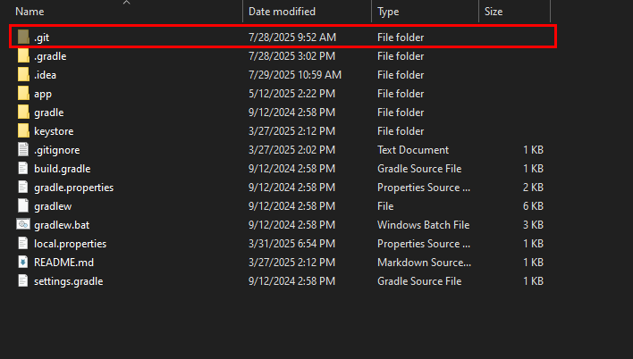

# Git Beginner

> - Ở cấp bậc này chỉ cần thuộc hoặc hiểu một số lệnh cơ bản là được rồi.
> - Yêu cầu không cao nên sự phân nhánh / kiểm soát phân nhánh sẽ không cần biết.

## Tệp .git

Mọi thư mục xác định là _kho lưu trữ git_ sẽ đều tồn tại ___thư mục ẩn___ `.git`:

<figure markdown="span">
    
    <figcaption>Thư mục .git luôn tồn tại trong mọi kho lưu trữ git</figcaption>
</figure>

Thế nên muốn biết tại thư mục đó có thể dùng lệnh git hay không hãy tìm tệp đó.

Tác dụng của tệp `.git` chính là khu vực lưu trữ phiên bản, lưu trữ lịch sử, lưu trữ cấu hình, thực thi commit, ...

Tương tự, git cũng có câu lệnh để biến một thư mục trở thành dạng kho lưu trữ git chính là `git init`. Hãy dùng nó trong một thư mục bất kỳ, sẽ thấy sau câu lệnh sẽ có thư mục `.git` xuất hiện trong thư mục.

## Xem thông tin

### git remote

Đầu tiên thì phải nói là lệnh này không bắt buộc hoặc thực sự quá quan trọng sau khi dự án đã/đang hoạt động. Lệnh này sẽ trình diễn ra một số thứ quan trọng và cần thiết để hiểu rõ hơn về sau.

Đầ tiên tại _kho lưu trữ git_, hãy sử dụng _command_:

```txt
git remote -v
```

Lệnh này sẽ cho ta biết ba giá trị quan trọng là `remote url`, `remote` và `branch`. ___(Với kho lưu trữ được tạo từ init thì không có gì cả)___.

Một giá trị mẫu là:

```txt
origin  git@github.com:dothanhdathp/git-example.git (fetch)
origin  git@github.com:dothanhdathp/git-example.git (push)
```

Thế nên:
- `remote url` = `git@github.com:dothanhdathp/git-example.git`
- `remote` = `origin`

Lệnh này cho ta thấy _kho lưu trữ_ này được tải xuống từ __github__ bằng đường dẫn `git@github.com:dothanhdathp/git-example.git`. ___remote___ hiện tại là ___origin___ ___(lưu ý điều này để dùng về sau)___

### git branch

Và tiếp đến xem nhánh hoạt động hiện tại với `git branch`

```bash
$ git branch
* main
```

Nếu muốn xem nhiều nhánh hơn có thể dùng `git branch -a`:

```bash
$ git branch -a
* main
  remotes/origin/HEAD -> origin/main
  remotes/origin/main
```

Trong trường hợp này nếu có nhiều hơn một nhánh sẽ xuất hiện trong kết quả.

## Pull

!!! warning "Warning"
    Hãy nhớ trước mỗi lần bắt đầu thao tác điều gì trên nhánh cần phải ___pull___ về trước. Điều này đặc biệt hữu ích nên hãy hình thành thói quen cho nó.

```txt
git pull
```

Trong một số trường hợp sẽ có lỗi xảy ra, hãy lưu lại thay đổi để tránh xảy ra trường hợp `config`. Điều này thường có thể đọc được trong thông báo lỗi, thường là do bản thân đang chỉnh sửa tệp nào đó mà tệp đấy lại vừa bị sửa đổi bởi ___commit___ sẽ được kéo về. Thế nên lỗi là điều hiển nhiên. Dùng lệnh này để kiểm soát nhánh luôn được ổn định.

### Giải quyết vấn đề

Ở cấp bậc này việc giải quyết vấn đề theo cách đơn giản nhất là có thể sao chép, hoặc ghi nhớ lại những thay đổi trước khi dùng lệnh này:

```bash
git reset --hard HEAD
```

Lệnh `reset --hard HEAD` sẽ xóa toàn bộ sự thay đổi cục bộ tại vị trí __HEAD__ trên nhánh cục bộ. Sau khi thực hiện lệnh này có thể `git pull` dự án về được rồi.

Hoặc đôi khi có thể thực hiện lệnh sau với tác dụng tương đương:

```bash
git reset --hard origin/main
```

Lệnh này chắc ăn hơn vì nó sẽ chỉ đích danh việc `reset` sẽ được thực hiện nhánh `origin/main`, tức là xóa toàn bộ sự thay đổi cục bộ về đúng nhánh `origin/main`.

_Trong ví dụ sử dụng `origin/main`, thực tế sẽ xem git `remote` và `branch` là gì để `reset` chính xác._

## Add

Đói với việc `git add` có một vài biến thể với một số cách sau đây _(nhớ là được)_

Trước khi dùng lệnh này, hãy `git status` để xem những tệp nào đang bị sửa đổi. __Thường thì tệp bị thay đổi sẽ có màu đỏ__ nếu có bật tùy chọn mày sắc cho `console`.

Cách thêm tệp như này:

- Với một số lượng tệp không nhiều có thể thêm từng tệp như này:
    ```bash
    git add file
    ```
- Hoặc là thêm nhiều tệp một lúc:
    ```bash
    git add file1 file2 file3
    ```
- Hoặc là thêm thay đổi của tất cả các tệp trong 1 thư mục nào đó:
    ```bash
    git add folder
    ```
- Nếu thêm toàn bộ thay đổi thì <mark>(cẩn thận lệnh này đôi khi cũng thêm cả mấy tệp như `.vscode` vào)</mark>:
    ```bash
    git add .
    ```

## Commit

Lệnh này chỉ có hai cách đơn giản để ___commit___ là:

- Nếu chỉ định commit một dòng thì dùng:
    ```txt
    git commit -m "<commit message>"
    ```
- Nếu nhiều hơn một dòng thì nên dùng `git commit` và nó sẽ mở tệp _commit message_ bằng `text editor` để sửa đổi.

## Push

- Đơn giản nhất là:
    ```txt
    git push
    ```
- Nhưng có nhiều nhánh hoặc nhiều đường hơn không nên sử dụng nó mà nên dùng bản đầy đủ:
    ```txt
    git push origin main
    ```