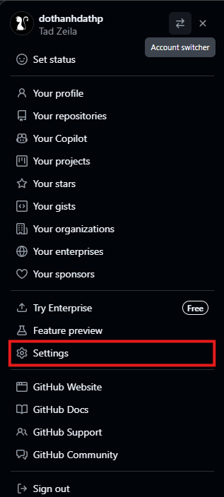
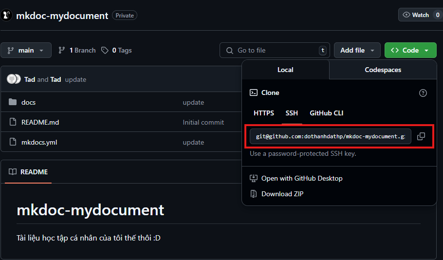

# Git start

Hướng dẫn bắt đầu với __Git__.

## Các bước bắt đầu với Github

### Tạo ssh key

Bước đầu tiên là cần tạo một `key gen` với

```bash
ssh-keygen
```

Nếu gặp hai lựa chọn này thì chỉ hãy điền ___seed___ _(là chuỗi ký tự bất kỳ đề generate pass)_ đơn giản nhất có thể dùng `space`:

```bash
Enter passphrase (empty for no passphrase):
Enter same passphrase again:
```

Kết quả sẽ được như thế này:

```txt
Generating public/private ed25519 key pair.
Enter file in which to save the key (C:\Users\DAT/.ssh/id_ed25519):
Enter passphrase (empty for no passphrase):
Enter same passphrase again:
Your identification has been saved in C:\Users\DAT/.ssh/id_ed25519
Your public key has been saved in C:\Users\DAT/.ssh/id_ed25519.pub
The key fingerprint is:
SHA256:1G/scYQywn3rXaqwN4jZkqxstR6nPOGQMHhy7Zle7Ro dat@SER9
The key's randomart image is:
+--[ED25519 256]--+
|                 |
|       . o   .   |
|   . .  + = o .  |
|  o = .. . * o   |
|   + + +S.  * . .|
|      * + .+ + o |
|     . *EOo.o o  |
|     .o.X=+oo.   |
|     .oo=+....   |
+----[SHA256]-----+
```

Xong keygen sẽ có hai tệp là `id_ed25519` và `id_ed25519.pub` nằm trong thư mục `.ssh`. Đường dẫn ở đây:

=== "Windows"
    ```text
    %USERPROFILE%\.ssh
    ```
=== "Ubuntu/Linux"
    ```text
    ~/.ssh
    ```

### Thêm ssh-key vào trong Github

1. Ở tài khoàn `github` ấn vào hình đại diện nằm ở góc phải bên trên cùng, chọn __Settings__:
    * 
1. Chọn mục __SSH and GPT keys__ và __New SSH key__
    * 
1. Cuối cùng trong bảng này điền nội dung tệp `id_ed25519.pub` vào:
    * 

### Clone dự án

- Với ___git-reponsity___, băt đầu clone dự án với đường dẫn lấy ở đây:
    * 
- Sử dụng lệnh sau để lấy dự án về:
    * ```text
        git clone git@github.com:dothanhdathp/mkdoc-mydocument.git
        ```

Thế là xong rồi. Dự án đã về.