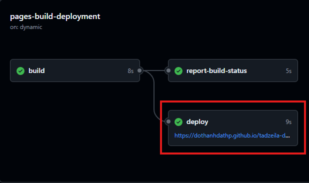

# Github publisher issue

## Tạo

Tạo tệp `.github\workflows\ci.yml` và điền nội dung như này:

```bash
name: ci 
on:
  push:
    branches:
      - main
      - master
      - public
permissions:
  contents: write
jobs:
  deploy:
    runs-on: ubuntu-latest
    steps:
      - uses: actions/checkout@v3
      - uses: actions/setup-python@v4
        with:
          python-version: 3.x
      - uses: actions/cache@v4
        with:
          key: ${{ github.ref }}
          path: .caches
      - run: pip install mkdocs-material
      - run: pip install pillow cairosvg
      - run: pip install mkdocs-puml
      - run: pip install mkdocs-plantuml
      - run: pip install mkdocs
      - run: pip install mkdocs_puml
      - run: pip install pymdown-extensions
      - run: mkdocs gh-deploy --force
```

Mục branch cần chú ý:
- main
- master
- public

- Sau đó và đây để chỉnh sửa:
  * 
  * __Settings__/__Pages__/__gh-page__/__Save__
- Trở lại thẻ ___Actions___ -> ___pages-build-deployment___ -> ___pages-build-deployment___
  * 
- Xem trang web ở đây:
  * 

## Lỗi plantuml plugin is not installed

```bash
ERROR   -  Config value 'plugins': The "plantuml" plugin is not installed
```

Tải về các gói phụ thuộc dưới này:

```bash
pip install mkdocs-puml
pip install mkdocs-plantuml
pip install mkdocs_puml
pip install mkdocs
pip mkdocs-material
pip mkdocs_puml
pip pymdown-extensions
```

Thêm vào tệp `.yml`

```yml
plugins:
  - search
  - plantuml:
      puml_url: https://www.plantuml.com/plantuml/
```

Bỏ cờ dưới này đi nếu muốn build thành công, mặc dù hiện tại mình cũng chưa rõ nó build ra cái gì.

```bash
plugins:
  - puml
  - build_plantuml:
       render: local
       bin_path: /path/to/plantuml
```

Xong sau đó mở `python enviroment`

```bash
python -m venv venv
```

Tiếp đến là chạy biến môi trường:

=== "Windows Batch"
    ```batch
    venv\Scripts\activate.bat
    ```
=== "Windows Power Shell"
    ```ps
    .\venv\Scripts\Activate.ps1
    ```
=== "Bash (Linux, Ubuntu, ...)"
    ```bash
    source venv/Scripts/activate
    ```

Rồi build bằng lệnh:

```bash
mkdocs build
```

Rồi chạy lại lệnh dưới này:

```bash
mkdocs gh-deploy --force
```