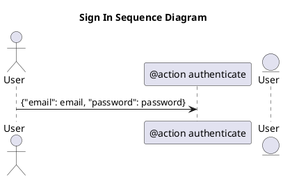

# PlantUML

> Tham khảo ở [đây](https://medium.com/@michkravets/add-inline-plantuml-to-your-mkdocs-documentation-9a2acb7599a6)

## Tải công cụ generate cho plantuml

Tải gói plantuml cho mkdocs như này:

```bash
pip install mkdocs_puml
```

## Khai báo tệp vào dưới tệp yml

Thêm đoạn dưới này vào tệp `mkdocs.yml`

```yml
plugins:
    - plantuml:
        puml_url: https://www.plantuml.com/plantuml/
        num_workers: 8
```

Cuối cùng có thể tạo plantuml như dưới này:

```text


Và kết quả như dưới này:

