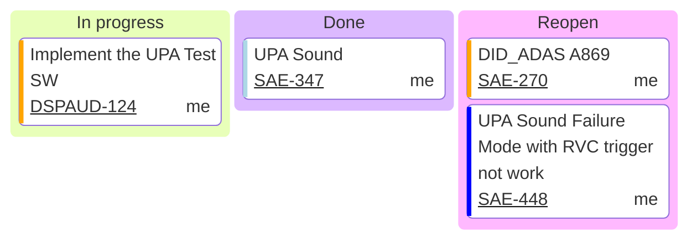

Task

```mermaid
---
config:
  kanban:
    ticketBaseUrl: 'https://kanavi-mobility.atlassian.net/browse/#TICKET#'
---
kanban
    InProgress[In progress]
        dspaud124[Implement the UPA Test SW]@{assigned: 'me', priority: 'High', ticket: DSPAUD-124}
    Done[Done]
        sae347[UPA Sound]@{assigned: 'me', priority: 'Very Low', ticket: SAE-347}
    Reopen[Reopen]
        sae270[DID_ADAS A869]@{assigned: 'me', priority: 'High', ticket: SAE-270}
        sae448[UPA Sound Failure Mode with RVC trigger not work]@{assigned: 'me', priority: 'Low', ticket: SAE-448}
```