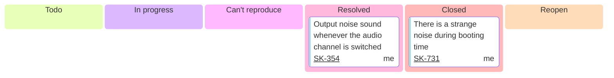

# Kama Note



[<mark>All Issue Tracking</mark>](https://kanavi-mobility.atlassian.net/issues/?jql=assignee%20%3D%20712020%3A83e9c497-d137-41ac-8a03-111fb63ccbcd%20AND%20project%20%3D%20SK)

- [ ] __SK-354__ [[Audio Control] Output noise sound whenever the audio channel is switched](https://kanavi-mobility.atlassian.net/browse/SK-354)
    - Đã có Application mới nhưng nó vẫn lỗi, khá tệ.
- [ ] __SK-731__ [[Audio Control] There is a strange noise during booting time](https://kanavi-mobility.atlassian.net/browse/SK-731)
    - Issue này mình nói ở RADIO nhưng mọi người ko tin.
    - Tiếp cần xem cái âm thanh này ở đâu và xử lý như nào.

## adb

```bash
settings put global adb_enabled 0
settings put global adb_enabled 1
```

```bash
adb root
adb remount
```

```bash
adb reboot
```

```bash
su
setprop service.adb.tcp.port 5555
stop adbd
start adbd
```

```bash
for i in $(seq 376 379); do su 0 tinymix $i 180; done;
```

```bash
for i in $(seq 376 379); do su 0 tinymix $i 255; done;
```

## Module

### audio.primary.exynosauto9

!!! info "audio.primary.exynosauto9"
    - Director:
        ```txt
        /home/dtdat/workstation/kama/sources/Android/hardware/samsung_slsi/exynos`
        ```
    Device Target:
        ```txt
        /vendor/lib64/hw/audio.primary.exynosauto9
        ```
    - Output 1:
        ```txt
        /home/dtdat/workstation/kama/sources/Android/out_atom_userdebug/target/product/atom/obj/SHARED_LIBRARIES/audio.primary.exynosauto9_intermediates/audio.primary.exynosauto9.so`
        ```
    - Output 2:
        ```txt
        home/dtdat/workstation/kama/sources/Android/out_atom_userdebug/target/product/atom/vendor/lib64/hw/audio.primary.exynosauto9.so
        ```

#### Make

```bash
make audio.primary.exynosauto9
```

####  ADB Load

```bash
adb root
adb remount
adb push \\192.168.100.203\X11DPi-2\sources\Android\out_atom_userdebug\target\product\atom\obj\SHARED_LIBRARIES\audio.primary.exynosauto9_intermediates\audio.primary.exynosauto9.so /vendor/lib64/hw/
```

#### Back Up

_Lưu lại tệp này trong trường hợp thư viện bị lỗi thì thiết bị sẽ luôn bị `reboot`, không thể bật lên._

```bash
su 0 cp /vendor/lib64/hw/audio.primary.exynosauto9.so /data/local/tmp/
```

#### Kill Sever

```bash
ps -A | grep "audioserver" | awk '{print $2}' | xargs su 0 kill -9
```

### libaudioproxy

!!! info "libaudioproxy"
    - Director:
        ```txt
        /home/dtdat/workstation/kama/sources/Android/device/kanavi/kama/audio
        ```
    - Device Target:
        ```txt
        vendor/vendor/lib64/libaudioproxy.so
        ```
    - Output Build 1:
        ```txt
        /home/dtdat/workstation/kama/sources/Android/out_atom_userdebug/target/product/atom/obj/SHARED_LIBRARIES/libaudioproxy_intermediates/libaudioproxy.so
        ```
    - Output Build 2:
        ```txt
        /home/dtdat/workstation/kama/sources/Android/out_atom_userdebug/target/product/atom/vendor/lib64/libaudioproxy.so
        ```

#### Make

```bash
make libaudioproxy
```

#### ADB Load

```bash
adb root
adb remount
adb push \\192.168.100.203\X11DPi-2\sources\Android\out_atom_userdebug\target\product\atom\obj\SHARED_LIBRARIES\libaudioproxy_intermediates\libaudioproxy.so /vendor/lib64/
```

#### Back Up

```bash
su 0 cp /vendor/vendor/lib64/libaudioproxy.so /data/local/tmp/
```

### Abox-Proxy

!!! info "Info"
    - Director:
        ```txt
        /home/dtdat/workstation/kama/sources/Android/device/kanavi/kama/audio
        ```
    - Device Target:
        ```txt
        vendor/bin/abox-kama-service
        ```
    - Output Build 1:
        ```txt
        /home/dtdat/workstation/kama/sources/Android/out_atom_userdebug/target/product/atom/vendor/bin/abox-kama-service
        ```

#### Make

#### ADB Load

```bash
adb root
adb remount
adb push \\192.168.100.203\X11DPi-2\sources\Android\out_atom_userdebug\target\product\atom\vendor\bin\abox-kama-service /vendor/bin/
```

#### Kill Sever

```bash
ps -A | grep "audioserver" | awk '{print $2}' | xargs su 0 kill -9
```

### abox-kama-service

!!! info "abox-kama-service"
    Play slience and etc ...

    - Director:
        ```txt
        /home/dtdat/workstation/kama/sources/Android/device/kanavi/kama/audio/abox-kama-service
        ```
    - Device Target:
        ```txt
        /system/priv-app/EmbeddedKitchenSinkApp
        ```
    - Output Build 1:
        ```txt
        /home/dtdat/workstation/kama/sources/Android/out_atom_userdebug/target/product/atom/vendor/bin/abox-kama-service
        ```
    - Output Build 2:
        ```txt
        /home/dtdat/workstation/kama/sources/Android/out_atom_userdebug/target/product/atom/obj/EXECUTABLES/abox-kama-service_intermediates/abox-kama-service
        ```

#### Make

```bash
make abox-kama-service
```
#### ADB Load

```bash
adb root
adb remount
adb push \\192.168.100.203\X11DPi-2\sources\Android\out_atom_userdebug\target\product\atom\vendor\bin\abox-kama-service /vendor/bin/
```

#### Back Up
#### Kill Sever

```bash
ps -A | grep "abox-kama-service" | awk '{print $2}' | xargs su 0 kill -9
```

#### Reload & Getlog

- User start
    ```txt
    ./vendor/bin/abox-kama-service&
    ```
- Getlog
    ```txt
    logcat -c
    logcat -b all -c
    logcat | grep abox-kama-service
    ```

## Application

### EmbeddedKitchenSinkApp

!!! info "EmbeddedKitchenSinkApp"
    - Director:
        ```txt
        /home/dtdat/workstation/kama/sources/Android/packages/services/Car/tests/EmbeddedKitchenSinkApp
        ```
    - Device Target:
        ```txt
        /system/priv-app/EmbeddedKitchenSinkApp
        ```
    - Output Build 1:
        ```txt
        /home/dtdat/workstation/kama/sources/Android/out_atom_userdebug/soong/.intermediates/packages/services/Car/tests/EmbeddedKitchenSinkApp/EmbeddedKitchenSinkApp/android_common/EmbeddedKitchenSinkApp.apk
        ```
    - Output Build 2:
        ```txt
        /home/dtdat/workstation/kama/sources/Android/out_atom_userdebug/target/product/atom/system/priv-app/EmbeddedKitchenSinkApp/EmbeddedKitchenSinkApp.apk
        ```

#### Make

```bash
make EmbeddedKitchenSinkApp 
```

#### ADB Load

```bash
adb root
adb remount
adb push \\192.168.100.203\X11DPi-2\sources\Android\out_atom_userdebug\target\product\atom\system\priv-app\EmbeddedKitchenSinkApp\EmbeddedKitchenSinkApp.apk /system/priv-app/EmbeddedKitchenSinkApp/
```

#### Open Application
    
```bash
adb shell am start -n com.google.android.car.kitchensink/.KitchenSinkActivity
```