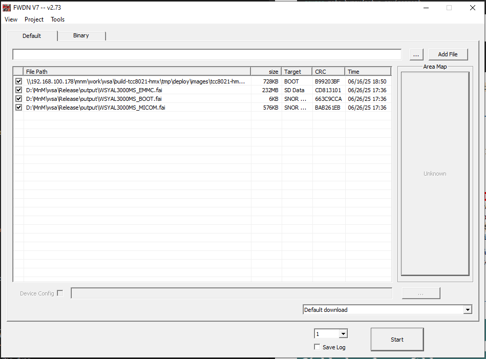
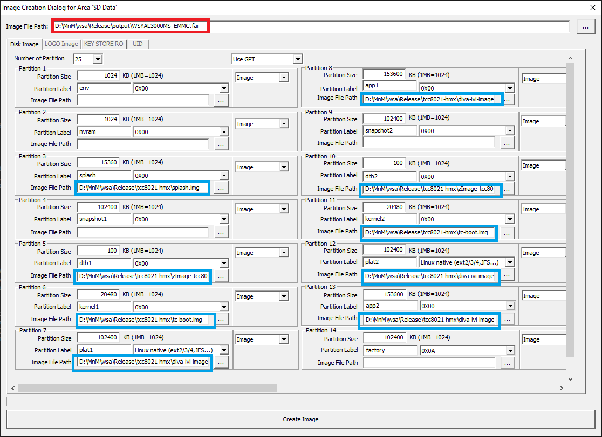
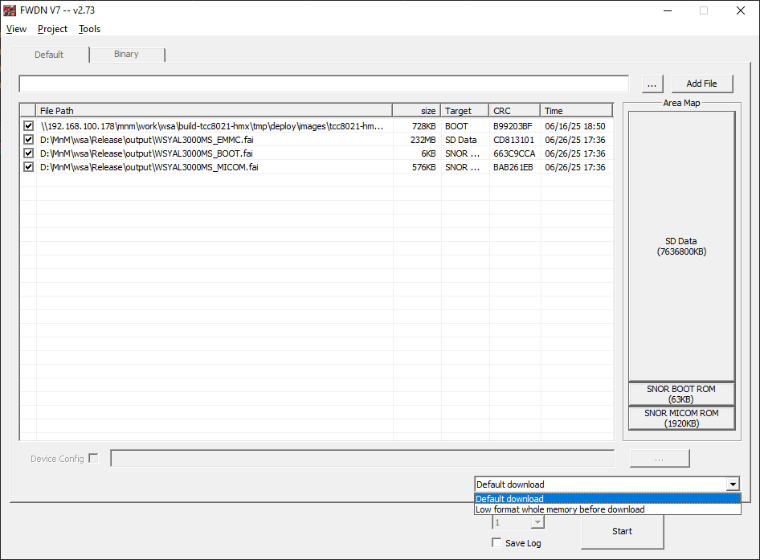

# FWDN and HDF

Hướng dẫn áp dụng bản dựng hệ thống vào trong thiết bị. Đầu tiên là vào trong thư mục source gốc, dùng lệnh `source` để cài đặt các thiết lập cho dựng hệ thống.

```bash
source meta-humax/setup-environment
```

Sau đó dùng 2 lệnh sau để build.
```bash
bitbake factory
bitbake diva-ivi-image
```
Kết quả sẽ thu được trong `/home/dtdat/work/wsa/build-tcc8021-hmx/tmp/deploy/images/tcc8021-hmx`

Hoặc trở lại thẻ [Release](work-wsa-release.md) và tải bất kỳ một phiên bản nào đó về.

## FWDN

### Tải và cài đặt

Sau khi dựng thành công, bắt đầu cài đặt __FWDN__ để build. Các bước và các tệp cần thiết có thể xem trên đường dẫn [06. [Z101] - FWDN](https://wiki.humaxdigital.com/display/autovn/06.+%5BZ101%5D+-+FWDN)

Tóm tắt ý chính cần:

- Tải về `vtcdrv_5.0.0.11.zip` và cài đặt ___driver___
- Tải về `FWDN_V7_2.73.zip`, <mark class=red>yêu cầu bắt buộc cần dùng FWDN_V7_2.73</mark>
- Chỉnh sửa nội dung tệp `FWDN_V7_0.INI`. _(Mặc định sẽ chọn `FWDN_V7_0.INI`. Nếu dùng __option__ khác hãy chọn lại tệp `*.INI`.)_
    - Sao chép nội dung tệp `FWDN_V7_0.INI` trong đường dẫn vào tệp `FWDN_V7_0.INI` của bạn tại đường dẫn:
        - `%USERPROFILE%/AppData/Local/VirtualStore/Windows/`
        - <mark>Note:</mark> Nếu tệp `FWDN_V7_0.INI` không tồn tại, hãy thử mở ứng dụng.
- Tải về bất kỳ bản __Release__ nào ở phần trên và thêm tất cả các tệp vào trong bằng nút __Add File__. Kéo tất cả các tệp có trong _tệp release (WSYAL3000MS_BOOT.fai, WSYAL3000MS_EMMC.fai, WSYAL3000MS_LK.rom, WSYAL3000MS_SNOR.fai)_ vào.
    - 

### Kết nối với HU

Để có thể đẩy bản dựng vào thiết bị cần có:
- Debug Zigg
    - ___Debug Zigg__ là một thiết bị nhỏ dùng để đọc log đầu ra. Về cách cắm thiết bị và nối dây hãy hỏi mọi người_ 
- 1 Dây nối nối cổng USB Port của thiết bị nối với cổng USB của máy tính.
    - Đầu ra cổng USB của bảng mạch sử dụng đầu `Mini-B`. Trong trường hợp bình thường sẽ có một đầu nối kéo dài chuyển đầu ra thành dạng `Type-A` cái. Lúc này dây nối có thể dùng dây 2 đầu USB

Các bước FWDN:

1. Nối ___Debug Zigg___ với máy tính, dùng dây 2 đầu nối Cổng sau thiết bị với máy tính.
1. Giữ nút `BOOT MODE` trên ___Debug Zigg___ và reset HU bằng nút nguồn.
    - Trường hợp vào _boot_mode_ thành công HU sẽ có màn hình đen (không có hình ảnh _logo_ giới thiệu của hãng xe)
    - FWDN sẽ tự động kết nối và mở ra bảng chọn như này (khi thành công)
        - 
        - _Các tệp *.fai, *.rom đã được thêm từ bước trước._
1. Trường hợp sử dụng các tệp `.fai` của bản release:
    - Trường hợp này không cần làm gì cả, chỉ cần ấn nút __Start__  là được.
1. Trường hợp muốn FWDN bản tự build, cần phải vào thay đổi một số cài đặt:
    - Nhớ bước dùng tệp `FWDN_V7_0.INI` ở trên không? Tệp đó chính là để dùng cho mục đích này.
1. Bấm vào nút __SD Data__ làm ví dụ sẽ thấy bảng như sau:
    - 
1. Nếu không có tệp mẫu `FWDN_V7_0.INI`, hều hết các giá trị ta sẽ phải điền bằng tay từng thành phần. Điều đó cực kỳ mất thời gian và dễ sai. Thay vào đó tệp `FWDN_V7_0.INI` đã điền đầy đủ rồi.
1. Nhưng, cần lưu ý sửa lại các đường dẫn. Các đường dẫn có luật như sau:
    - Tệp đầu tiên là ấn vào nút `...`, tìm tệp <mark class=red>build-tcc8021-hmx/tmp/deploy/images/tcc8021-hmx/lk-tcc8021-hmx.rom</mark> trong thư mục đầu ra và `Add File` đó vào.
    - Với các __Image File Path__ ở hàng trên cùng (ô màu đỏ) sẽ địa chỉ mà tệp `*.fai` <mark>được tạo ra</mark>. Các tệp này nên được để ở một thư mục riêng, ví dụ như trên là thư mục `output`.
    - Sau đó sửa các __Image File Path__ trong ô màu xanh thành các tệp có tên tương ứng trong thư mục build ở trên, thư mục `/home/dtdat/work/wsa/build-tcc8021-hmx/tmp/deploy/images/tcc8021-hmx`
        - _Có thể sửa trực tiếp trong tệp `FWDN_V7_0.INI`_
1. Ấn nút __Create Image__ ở dưới cùng, một tệp `*.fai` sẽ được tạo ra theo tên và đường dẫn được điền trong ô màu đỏ. Ở đây chính là `WSYAL3000MS_EMMC.fai`
    - _Việc đặt tên các tệp không có yêu cầu cụ thể, nhưng tốt nhất nên có quy luật để tránh gây hiểu lầm về sau hoặc khó lòng kiểm tra, tìm kiếm sai sót_

        |                | Tên tệp                   |
        | :------------- | :------------------------ |
        | SD Data        | __WSYAL3000MS_EMMC.fai__  |
        | SNOR BOOT ROM  | __WSYAL3000MS_EMMC.fai__  |
        | SNOR MICOM ROM | __WSYAL3000MS_MICOM.fai__ |

    - <mark class="red">Lặp lại các bước như trên với hai chế độ còn lại.</mark>
    - Nếu các tệp mới được tạo ra không tự động được thêm vào trong bảng, hãy tự thêm bằng tay như với chế độ __Release__
1. Có hai chế độ để ___write___ là ___Default download___ và ___Low format whole memory before download___
    - 
    - ___Default download___: Chế độ cơ bản, an toàn nhanh nhưng đôi khi (có thể) một vài vùng nhớ sẽ không được ghi đè. Gần giống như ___Quick format___ trên USB
    - ___Low format whole memory before download___: Chế độ _mạnh tay_, sẽ xóa vả ___rewrite___ lại tất cả vùng nhớ trên thiết bị.
1. Ấn Start để bắt đầu
1. Nếu không có vấn đề thì kết quả đại loại thế này:
    - 
1. Cuối cùng là tháo dây và ___reboot___ thiết bị là được.

!!! warning "Warning"
    - Thi thoảng nếu thiết bị không thể FWDN bằng ___Default download___, có thể thử lại bằng ___Low format whole memory before download___

## HDF

Chế độ ___HDF___ là hình thức cập nhật phiên bản thủ công. Hiệu tại vẫn chưa rõ HDF có nghĩa là gì nhưng nó cũng không còn phổ biến lắm. Sử dụng tệp `*.hdf` để cập nhật.

### Các bước thực hiện

- Đầu tiên cần phải thực hiện việc _build_ lại hệ thống. Ví dụ nếu bạn sửa ở _ivilauncher_ thì:
    - Build lại các module tổng
        ```bash
        bitbake factory -c do_compile -f
        bitbake diva-ivi-image -c do_compile -f
        ```
    - Dùng lệnh này để áp các thay đổi tới bản build chuẩn bị cho hdf
        ```bash
        bitbake factory
        bitbake diva-ivi-image
        ```
    - Build lại HDF để áp dụng các sửa đổi được ghi nhận ra tệp hdf
        ```bash
        bitbake hdf -c do_compile -f
        bitbake hdf
        ```
- Tạo bản hdf
    - Đi tới đừng dẫn chứa tệp hdf tại: `build-tcc8021-hmx/tmp/deploy/images/tcc8021-hmx/hdf_tools`
    - Chạy lệnh:
        ```bash
        ./hdf.sh wsyal3000ms
        ```
    - _Trong trường hợp không biết đối số đầu vào là gì có thể chạy độc lập `./hdf.sh`. Tệp script có cơ chế viết comment cho người phát triển_
    - _Ngoài module `wsyal3000ms` còn khá nhiều module khác nữa. Nhưng mình không biết nó dùng làm gì nên bỏ qua._
- Khi tệp `wsyal3000ms.hdf` được tạo thành công. Tải về tệp `wsyal3000ms.hdf` và lưu vào USB.
- Cắm USB vào HU, sang tab __Settings__ -> __System__ -> __System Info__
    - Nếu tệp `*.hdf` được HU nhận diện, nút `Software Update` sẽ sáng lên. Ấn và đó và HU sẽ thực hiện các bước cập nhật còn lại.

## Một số lưu ý

Thông thường đến hiện tại việc sử dụng sync sẽ thường thành công nhưng không thể lập bản dựng thường thường là do các gói cài đặt đã quá cổ nên đường dẫn đã bị thay đổi. Tốt nhất nên là sao chép lại các tệp từ các project cũ. Tốt nhất là nên sao lưu lại các gói cũ từ __những dự án MnM__ nằm trên các thiết bị cũ có thể __build__ được.
