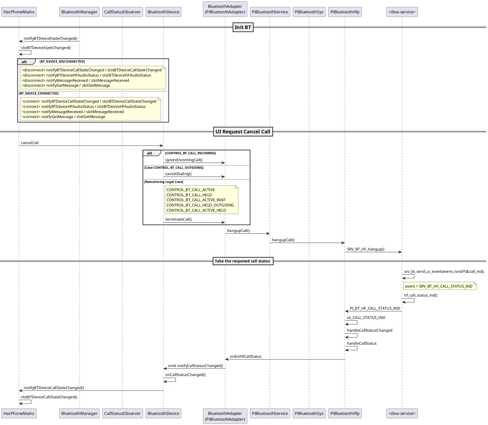

# Phone Mic Noise

## Tóm tắt nội dung:

1. Bên WSA yêu cầu _sửa đổi tính năng_.
    - Mục đích: <mark>Giảm thiểu tiếng ồn khi chuyển ___mode___ Hands-free/Handset</mark>
1. Thay đổi
    - __Previous__: Tạo một thread với Hands-free (SCO On) và đầy vào ___terminated___ khi mà __Handset__ hoặc __Call End__
    - __Hiện tại__: Giữ lại _thread_ SCO và chỉ kết thúc khi mà ___call end___.
        - _Mình không rõ cái này lắm nhưng mà có lẽ là BT sẽ biết chắc chắn hơn._
    - <mark class=red>Tôi muốn nhận phương thức được sử dụng trước đây trong UX để xác định kết thúc cuộc gọi.</mark> _(I would like to receive the method used previously in UX for determining the end of a call.)_

## Phản hồi

Mình trả lại cho họ một luồng hoạt động của ứng dụng và để bên HQ tự quyết định.

